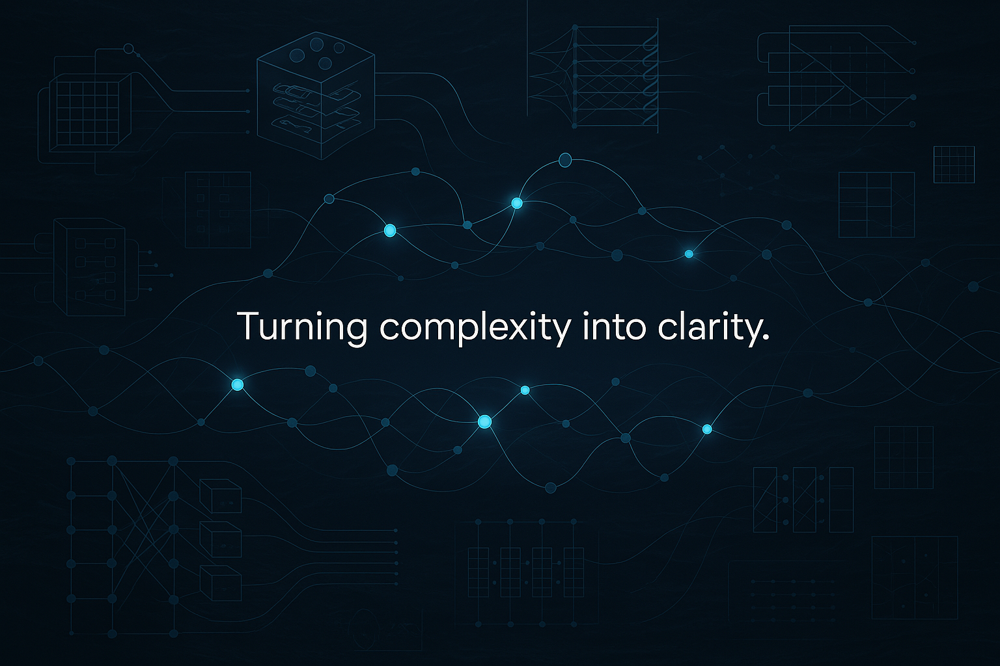

# Zane – Deep Learning Engineer and Researcher

---

### About Me

I’m a deep learning engineer driven by a passion for real-world impact. I build high-performance vision systems and intelligent tools for a range of industries — especially where reliability and explainability matter.

My work focuses on turning raw data into clear insights, using tools like **PyTorch**, **TensorFlow**, and **TensorRT**, and deploying models with **Docker** in challenging, real-time environments.

---

### Tech Stack

---

### Connect with Me

Reach out on [LinkedIn](https://www.linkedin.com/in/zane-neave-rex/) if you're interested in collaborating.

I’m always open to meaningful conversations, partnerships, and deep tech innovation.

---

### Outside of Code

When I’m not training models or writing code, I’m probably out **surfing**, playing **football**, or enjoying the coast.

---
